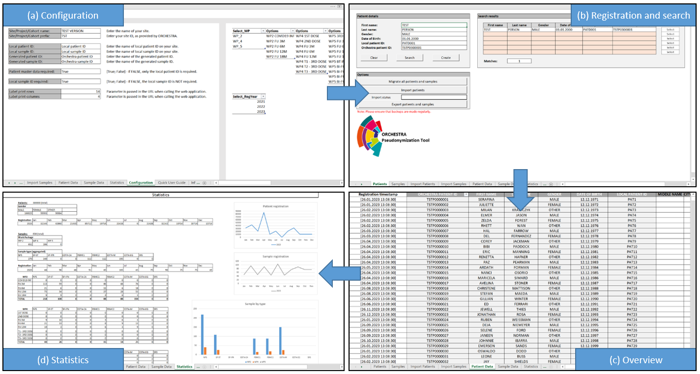

# ORCHESTRA Pseudonymization Tool

> The ORCHESTRA Pseudonymization Tool (OPT) is a pragmatic tool for 
> pseudonymizing subject and sample data. It supports both single 
> and multi-site use without worrying about pseudonym duplication. 
> It can also be used to manage pseudonymized data and generate sample 
> labels. Designed for rapid deployment, OPT has minimal technical 
> requirements and needs no installation. Just like for the usage, 
> the setup does not require any technical expertise. The tool is 
> available as open source for unlimited use and customization.

---

## Prerequisites

For using the OPT you only need Microsoft Excel (preferred) or LibreOffice Calc.
If you do not have both installed on your computer, you can easily download [LibreOffice](https://de.libreoffice.org/download/download/) for free.

Please make sure that macros are enabled.

## Launching

After downloading, the tool must be configured according to the context of use. This must be done initially before the first use. After the first use, it is strongly recommended not to change the configuration anymore.

## Features

The OPT was built to allow non-technical personell in medical research perform simple patient and sample data pseudonymization. 
We tried to achieve a very low threshold of technical prerequisites by using spreadsheet applications, which in most cases, is already avaible anywhere.

* No installation
* Rapid rollout
* Easy to set up and use
* Pseudonymization of subject and sample data
* Management of pseudonymized data
* Record Linkage
* Label generator (with optional DataMatrix, QR or Barcode)
* High adaptability and flexibility

## Screenshot

## Quick start guide

For using the tool, you need to download it from the repository first. We recommend that you create a folder structure that looks like this: 

        OPT
        ├── OPT_Excel.xlsm / OPT_LibreOffice.ods
        ├── OPT_UserManual.pdf
        ├── OPT_ReadOnly_Excel.bat / OPT_ReadOnly_LibreOffice.bat
        ├── OPT_LabelGenerator
        │   ├── labelGenerator.js
        │   ├── labelGenerator.html
        │   ├── labelGenerator.css
        │   ├── barcode.min.js
        │   ├── qrcode.min.js
        │   └── datamatrix.min.js
        └── OPT_Backups

If you use the OPT only on one computer, you can create the folder structure on your PC as you like. However, if you plan to work with it together with others, then you should save it on an internal network drive to which your colleagues have access. 
You should strongly avoid using online applications such as Excel-Online or Sharepoint, as they often conflict with documents, which can lead to data loss and/or duplicate registrations! 

When you have downloaded the tool and created the folder structure, you can start the OPT by double-clicking on "OPT_Excel.xslm" or "OPT_Excel.xslm". Then switch directly to the configuration worksheet. Make all necessary configurations there. Right-click on the worksheet tab and select "Hide" to hide the worksheet. Finally, you can also protect the document structure with a password (Menu, Tools, Protect document structure). Please be sure to note the password. The password cannot be recovered in case of loss. 

## License

This software is licensed under the Apache License 2.0. The full text is
accessible in the [LICENSE file](LICENSE).

## Acknowledgments

This work has been funded by the European Union Horizon 2020 research and innovation programme under the project ORCHESTRA grant agreement No 101016167.

