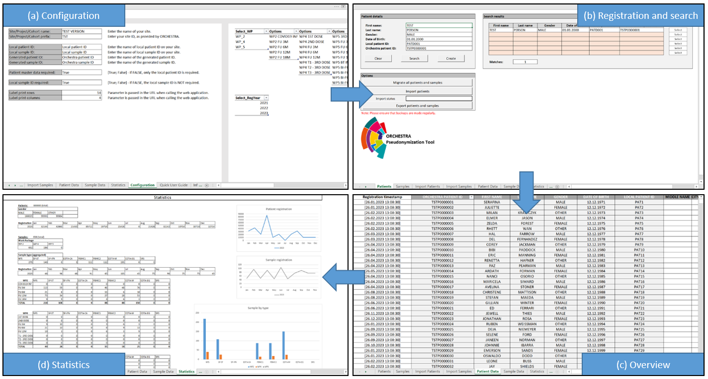
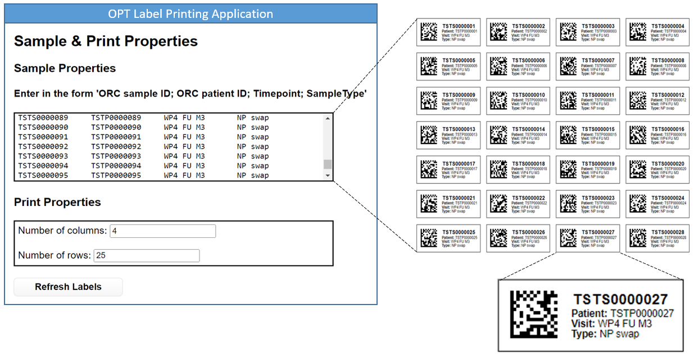

# ORCHESTRA Pseudonymization Tool

> Developed in the ORCHESTRA project as part of the EU's rapid response to the COVID-19 pandemic, the ORCHESTRA Pseudonymization Tool (OPT) is a pragmatic software for pseudonymizing subject
> and sample data. Designed for rapid deployment, the OPT has minimal technical requirements and needs no installation. Its use and setup do not require any technical
> expertise. It also supports both single and multi-site scenarios while handling pseudonym duplication.

---

## Prerequisites

The OPT uses a runtime environment that is available virtually everywhere without further technical setups: spreadsheet software in the form of Microsoft Excel (preferred) or LibreOffice Calc.
If you do not have any of them installed on your computer, you can download [LibreOffice](https://de.libreoffice.org/download/download/) for free. Please make sure that macros are enabled.

## Launching

After downloading the OPT, it must be configured according to its context of use. This must be done initially before the first patients or samples are registered. After the first use, it is strongly recommended not to change the configuration anymore.

## Features

The main functionalities of the OPT are the management of the identities of patients or study participants as well as biosamples for medical research projects and the generation and management of secure pseudonyms.

* No installation needed
* Suitable for rapid rollout
* Easy to setup and use
* Pseudonymization of subject and sample data
* Management of pseudonyms
* Simple record linkage mechanisms
* Generation of biosample labels (with optional DataMatrix, QR or Barcode)
* Highly configurable

## Screenshot

## Quick start guide

To use the OPT, you need to first download it from the "Release" folder in this GitHub repository. 
The folder contains an "opt-excel-bundle" and an "opt-libreoffice-bundle", which you can use according to your environment.
No further files are needed.
The structure of the bundles is as follows:

        opt-excel-bundle / opt-libreoffice-bundle
        ├── OPT_Excel.xlsm / OPT_LibreOffice.ods
        ├── user-manual.pdf
        ├── readonly-excel.bat / readonly-libreoffice.bat
        ├── label-printing-app
        │   ├── labels.js
        │   ├── labels.html
        │   ├── labels.css
        │   ├── barcode.min.js
        │   ├── qrcode.min.js
        │   └── datamatrix.min.js
        └── backups

For using the OPT on one computer, the bundle can be placed anywhere on the PC. In a multi-user setting, the OPT needs to be stored on an internal network drive that all users can access. 
*The OPT does not work in online appliations, such as Office 365.*

Once you have downloaded the repository and selected the required bundle, you can start the OPT by double-clicking on "OPT_Excel.xslm" or "OPT_LibreOffice.ods". Please perform the entire
configuration according to the description in the [user manual](./development/documentation/user-manual.pdf), which is also included in your bundle, before using it for the first time. It takes only a few minutes.

## License

This software is licensed under the Apache License 2.0. The full text is
accessible in the [LICENSE file](LICENSE).

## Acknowledgments

This work has been funded by the European Union Horizon 2020 research and innovation programme under the project ORCHESTRA grant agreement No 101016167.

